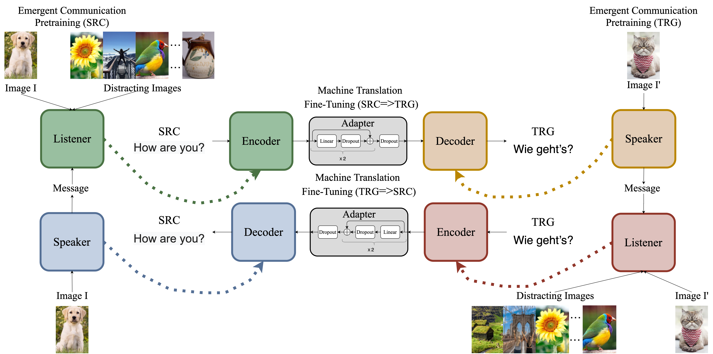

# ECNMT: Emergent Communication Pretraining for Few-Shot Machine Translation
This repository is the official PyTorch implementation of the following [paper](https://coling2020.org/pages/accepted_papers_main_conference): 

Yaoyiran Li, Edoardo Maria Ponti, Ivan Vulić, and Anna Korhonen. 2020. *Emergent Communication Pretraining for Few-Shot Machine Translation*. In Proceedings of the 28th International Conference on Computational Linguistics (COLING 2020).

This method is a form of unsupervised knowledge transfer in the absence of linguistic data, where a model is first pre-trained on *artificial* languages emerging from referential games and then fine-tuned on few-shot downstream tasks like neural machine translation.



## Dependencies

- PyTorch 1.3.1
- Python 3.6

## Data
COCO image features are available in the sub-folder `half_feats` [here](https://drive.google.com/open?id=14XUGgnXbt--rwfyM-raz9BKKJlnV1zXh). Preprocessed EN-DE (DE-EN) data for translation are available in the sub-folder `task1` [here](https://drive.google.com/open?id=14059L8cfNxxtR8jwRmOS45NmP0J7Rg9r). Both are obtained from [Translagent](https://github.com/facebookresearch/translagent).

Please find the data for translation in the other language pairs (EN-CS, EN-RO, EN-FR) in the links below.
 
| Dictionaries | Train Sentence Pairs | Reference Translations |
| ------------ | -------------------- | ---------------------- |
|  [EN-CS & CS-EN](https://drive.google.com/drive/folders/1yU-eEWE7QbfUho91Z5BvbfNWwuhnxEUL?usp=sharing) |  [EN-CS & CS-EN](https://drive.google.com/drive/folders/1X-AMqvo3sJdOrYtX6svb6xjapEuqv9l2?usp=sharing) | [EN-CS & CS-EN](https://drive.google.com/drive/folders/1jvq-iJS-Yo3zRz3wh4BMGJOwkGMe9pAg?usp=sharing) |
|  [EN-RO & RO-EN](https://drive.google.com/drive/folders/1c9MEgKBHkOs8mLnwelWnjUbNXZlXqWb6?usp=sharing) |  [EN-RO & RO-EN](https://drive.google.com/drive/folders/1NAFQ8GwV4CVGcTLKLXkJnEn3HI9IalgL?usp=sharing) | [EN-RO & RO-EN](https://drive.google.com/drive/folders/1Tc-1wSqoe7K4HXBiQzOc1gL1lp0IS6Cg?usp=sharing) |
|  [EN-FR & FR-EN](https://drive.google.com/drive/folders/1R3jvKwjFdzGNpqLSeChjeB7HoaRwcz5d?usp=sharing) |  [EN-FR & FR-EN](https://drive.google.com/drive/folders/1B7VLWSwQPOVZL96Q6t2jNcpzzF1ejk1m?usp=sharing) | [EN-FR & FR-EN](https://drive.google.com/drive/folders/1VP3DRNtCw1SimTeWJp--ARYBdklU5i8X?usp=sharing) |


## Pretrained Models for Emergent Communication
| Source / Target | Target / Source |
|---|---|
| [EN](https://drive.google.com/file/d/1PiAdeUuSjjlgfLMkEmTdD2EtPuPwUgq4/view?usp=sharing) | [DE](https://drive.google.com/file/d/16_pOVlQhqHnjv_LuyaAzYCHhRiCKrCvP/view?usp=sharing) |
| [EN](https://drive.google.com/file/d/1z0JbwMxgB32CYXn99RbdhHreZpzeME-1/view?usp=sharing) | [CS](https://drive.google.com/file/d/1WfQzwItzMEHnd0jzwSPFx1K806TMLjku/view?usp=sharing) |
| [EN](https://drive.google.com/file/d/1dvGcmjIg5bSMUR89abv_zPQo4TmuwXHF/view?usp=sharing) | [RO](https://drive.google.com/file/d/12_OXbnBpIRzwrBq1PDGCy-SJi0FwLpfq/view?usp=sharing) |
| [EN](https://drive.google.com/file/d/1cbQCTL6e1U6ctmKf1kVlYy9192V48QjK/view?usp=sharing) | [FR](https://drive.google.com/file/d/1MSM4pyXEVHve3fTqnaB5kY-HkqccMQAm/view?usp=sharing) |
## Experiments

Step 1: run EC pretraining (otherwise go to Step 2 and use a pretrained model).
```bash
cd ./ECPRETRAIN
sh run_training.sh
 ```
                         
Step 2: run NMT fine-tuning (please modify the roots for training data, pretrained model and saved path before).
```bash
cd ./NMT
sh run_training.sh
```

Optional: run baseline

```bash
cd ./BASELINENMT
sh run_training.sh
 ```
   
## Citation

    @inproceedings{YL:2020,
      author    = {Yaoyiran Li and Edoardo Maria Ponti and Ivan Vulić and Anna Korhonen},
      title     = {Emergent Communication Pretraining for Few-Shot Machine Translation},
      year      = {2020},
      booktitle = {Proceedings of the 28th International Conference on Computational Linguistics},
    }
    
## Acknowledgements

Part of the code is based on [Translagent](https://github.com/facebookresearch/translagent). 

The datasets for our experiments include [MS COCO](http://cocodataset.org/#home) for Emergent Communication pretraining, [Multi30k Task 1](https://github.com/multi30k/dataset) and [Europarl](http://www.statmt.org/europarl/v7/) for NMT fine-tuning. Text preprocessing is based on [Moses](https://github.com/moses-smt/mosesdecoder "Moses") and [Subword-NMT](https://github.com/rsennrich/subword-nmt "Subword-NMT"). 

Please cite these resources accordingly.
